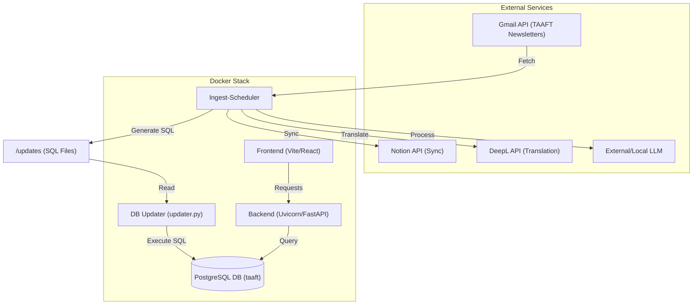
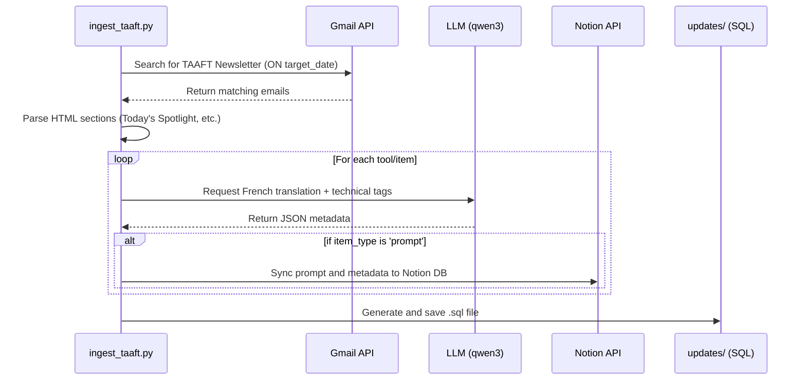

# Architecture - TAAFT Datligent

This document describes the architecture of the **TAAFT Datligent** project using a Mermaid diagram.

## Architecture Diagram

## Application Logic Flow (Ingestion & Sync)

*Voir aussi : [ingest_taaft.mermaid](file:///Users/adminmac/taaft-datligent/ingestion/ingest_taaft.mermaid)*

The TAAFT ingestor includes translation and synchronization with Notion.

## Component Roles

- **Frontend**: Modern web interface (Vite) for managing TAAFT articles.
- **Backend**: Python-based API server.
- **DB (PostgreSQL)**: Database for storing all processed TAAFT data.
- **Ingest-Scheduler**: Complex service that fetches TAAFT newsletters, translates content via DeepL, extracts metadata using an LLM, and synchronizes results with a Notion database.
- **DB Updater**: Python script that applies SQL updates generated by the ingestor.
- **Notion Integration**: Specific to TAAFT, allows external tracking and management of articles.
